       

# 📦 Awesome Software Artifact Repository Ecosystem 🚀

> **A curated, comprehensive directory of SaaS commercial platforms, cloud-native artifact registries, self-hosted package repositories, and open-source binary management tools.**

Welcome to the ultimate reference guide for **software artifact repository management**, **package registries**, and **private binary storage infrastructure**. Whether you are building cloud-native microservices, managing enterprise software supply chains, hosting private `npm`/`PyPI`/`NuGet`/`Maven`/`Docker` packages, or setting up zero-trust artifact governance, this list covers the top commercial and open-source solutions available today.

---

## 📋 Table of Contents

- [📊 SaaS & Hosted Platforms](#-saas--hosted-platforms)
  - [📈 Market Size & Industry Structure](#-market-size--industry-structure)
  - [🏢 SaaS Products Comparison Matrix](#-saas-products-comparison-matrix)
- [🔓 Open-Source GitHub Projects](#-open-source-github-projects)
  - [⭐ Top Open-Source Artifact Repositories (Sorted by Stars)](#-top-open-source-artifact-repositories-sorted-by-stars)
  - [🧩 Open-Source Ecosystem Categories](#-open-source-ecosystem-categories)
- [🛡️ Artifact Storage & Object Backends](#%EF%B8%8F-artifact-storage--object-backends)
- [🤝 How to Contribute](#-how-to-contribute)
- [⚠️ Security & Governance Disclaimer](#%EF%B8%8F-security--governance-disclaimer)
- [💖 Support & Sponsorship](#-support--sponsorship)
- [📈 Star History](#-star-history)

---

## 📊 SaaS & Hosted Platforms

### 📈 Market Size & Industry Structure

> 💡 **Sector Economic Summary (2026):** The global software artifact repository and package management market is estimated at **\$3.5 Billion** and projected to grow to **\$6.8 Billion by 2030** (CAGR ~14.5%). The market is **moderately fragmented**: cloud hyper-scalers (*Microsoft Azure/GitHub, Google Cloud, AWS*) dominate integrated cloud-native CI/CD workloads; specialized enterprise leaders (*JFrog Artifactory, Sonatype Nexus*) hold dominant market share for complex multi-format governance and enterprise supply chain compliance; while focused vendors (*Cloudsmith, Inedo, Packagecloud*) serve dedicated developer and platform engineering niches.

---

### 🏢 SaaS Products Comparison Matrix

*Products are sorted by **Company Size / Valuation** in descending order.*

| 🏢 Product & Platform | 💰 Company Size / Valuation | 🏷️ Starting Paid Pricing | 🎁 Free Tier / Trial Limits | ⚡ Primary Formats & Use Case |
| :--- | :--- | :--- | :--- | :--- |
| **[Azure Artifacts](https://azure.microsoft.com/en-us/products/devops/artifacts/)** | **~$3.2 Trillion** *(Microsoft)* | **$2.00 / GB / month** (billed beyond free quota) | **2 GB storage free forever** for all Azure DevOps users (5 free users included) | `npm`, `NuGet`, `Maven`, `PyPI`, `Universal Packages`. Best for Azure DevOps CI/CD pipelines. |
| **[GitHub Packages](https://github.com/features/packages)** | **~$3.2 Trillion** *(Microsoft)* | **$0.25 / GB / month** storage & $0.50 / GB transfer; Team plan at **$4.00 / user / month** | **500 MB storage & 1 GB transfer / month free forever** for GitHub Free accounts | `npm`, `Docker/OCI`, `Maven`, `NuGet`, `RubyGems`, `Containers`. Best for GitHub-centric development teams. |
| **[Google Artifact Registry](https://cloud.google.com/artifact-registry)** | **~$2.2 Trillion** *(Alphabet)* | **$0.10 / GB / month** storage; network egress **$0.08–$0.12 / GB** | **0.5 GB (500 MB) storage / month free forever** under Google Cloud Free Tier | `Docker/OCI`, `Maven`, `npm`, `PyPI`, `Go`, `Apt`, `Yum`, `Helm`. Best for GCP infrastructure & Kubernetes workloads. |
| **[AWS CodeArtifact](https://aws.amazon.com/codeartifact/)** | **~$1.9 Trillion** *(Amazon)* | **$0.05 / GB / month** storage; **$0.05 per 10,000 requests** | **2 GB storage & 100,000 requests / month free forever** under AWS Free Tier | `npm`, `PyPI`, `Maven`, `NuGet`, `Swift`, `Cargo`. Best for AWS-native cloud applications. |
| **[GitLab Package Registry](https://docs.gitlab.com/ee/user/packages/)** | **~$8.0 Billion** *(GitLab Inc.)* | Premium at **$29.00 / user / month**; Ultimate at **$99.00 / user / month** | **5 GB storage & 10 GB data transfer / month free forever** per group on GitLab Free | `npm`, `Maven`, `NuGet`, `PyPI`, `Composer`, `Conan`, `Helm`, `Terraform`. Best for end-to-end GitLab DevOps pipelines. |
| **[JFrog Artifactory](https://jfrog.com/artifactory/)** | **~$3.5 Billion** *(JFrog Ltd.)* | Cloud Pro starting at **$98.00 / month** (or **$0.005 / GB / hour**) | **500 MB storage & 2 GB transfer / month free forever** (JFrog Cloud Free Tier) | **30+ package formats** (`Maven`, `npm`, `PyPI`, `Docker`, `NuGet`, `Go`, `Helm`, `Cargo`). Best for enterprise supply chain governance. |
| **[Sonatype Nexus Repository Pro](https://www.sonatype.com/products/nexus-repository)** | **~$1.5 Billion** *(Sonatype)* | Nexus Pro starting at **$120.00 / user / year** (*~$10.00 / user / month*, min $1,200/yr) | **14-day free trial** of Nexus Repository Pro (unlimited features & storage during trial) | `Maven`, `npm`, `NuGet`, `PyPI`, `Docker`, `RubyGems`, `Helm`, `Apt`, `Yum`. Reference standard for JVM & enterprise artifact architecture. |
| **[Cloudsmith](https://cloudsmith.com/)** | **~$120 Million** *(Cloudsmith)* | Developer / Team starting at **$18.00 / user / month** (or **$49.00 / month** team base) | **14-day free trial** with **50 GB storage & 50 GB bandwidth**; Free forever for verified Open Source | **28+ formats** with multi-region global CDN edge distribution. Best for cloud-native software delivery & SaaS ISVs. |
| **[ProGet](https://inedo.com/proget)** | **~$20 Million** *(Inedo)* | Basic Paid Edition starting at **$1,200.00 / year** (*~$100.00 / month*); Enterprise $3,000/yr | **Free Forever Basic Edition** (up to 5 users, 1 feed per format type, unlimited storage) | `NuGet`, `npm`, `PyPI`, `Maven`, `Docker`, `Helm`, `Asset Feeds`. Best for Windows-centric .NET & enterprise IT stacks. |
| **[Packagecloud](https://packagecloud.io/)** | **~$10 Million** *(Computable Labs)* | Developer Plan starting at **$49.00 / month** | **14-day free trial** (includes **10 GB storage & 50 GB transfer**); Free tier for non-profits | `Apt`, `Yum`, `RubyGems`, `npm`, `Python`. Best for Linux distribution package hosting & deb/rpm repositories. |

---

## 🔓 Open-Source GitHub Projects

Open-source artifact repositories provide full self-hosted control, private package caching, air-gapped security, and zero licensing cost for internal infrastructure.

### ⭐ Top Open-Source Artifact Repositories (Sorted by Stars)

| 🏆 Project & Repository | ⭐ GitHub_Stars | 📜 License | 🎯 Description & Primary Focus |
| :--- | :--- | :--- | :--- |
| **[CNCF Harbor](https://github.com/goharbor/harbor)** |  | `Apache-2.0` | **Enterprise Cloud-Native Registry** — CNCF graduated project supporting Docker/OCI images and Helm charts with Trivy vulnerability scanning, RBAC, and policy replication. |
| **[Verdaccio](https://github.com/verdaccio/verdaccio)** |  | `MIT` | **Lightweight Private npm Proxy Registry** — Zero-config Node.js private registry and caching proxy for public npm packages. |
| **[OCI Distribution](https://github.com/distribution/distribution)** |  | `Apache-2.0` | **Reference Docker & OCI Registry** — The foundational engine behind Docker Registry and OCI artifact storage specification. |
| **[ChartMuseum](https://github.com/helm/chartmuseum)** |  | `Apache-2.0` | **Helm Chart Repository Server** — Open-source Helm chart server with multi-tenant storage backends (S3, GCS, Azure Blob, local). |
| **[Dragonfly2](https://github.com/dragonflyoss/dragonfly)** |  | `Apache-2.0` | **P2P Artifact Distribution & Acceleration** — CNCF incubating project providing peer-to-peer image and binary file distribution for large Kubernetes clusters. |
| **[Zot Registry](https://github.com/project-zot/zot)** |  | `Apache-2.0` | **OCI-Native Container Registry** — Production-ready, scale-out, vendor-neutral container image and OCI artifact registry. |
| **[Red Hat Quay](https://github.com/quay/quay)** |  | `Apache-2.0` | **Enterprise Container & Image Registry** — Red Hat's open-source container registry with geo-replication, Clair vulnerability scanning, and build automation. |
| **[BaGet](https://github.com/loic-sharma/BaGet)** |  | `MIT` | **Lightweight NuGet Server** — Open-source, cross-platform .NET Core server for hosting private NuGet packages and symbol feeds. |
| **[Nexus Repository OSS](https://github.com/sonatype/nexus-public)** |  | `EPL-1.0` | **Universal Artifact Repository** — The world's most deployed open-source binary repository supporting Maven, npm, NuGet, PyPI, Docker, and Go. |
| **[ORAS](https://github.com/oras-project/oras)** |  | `Apache-2.0` | **OCI Registry as Storage** — CNCF project enabling OCI registries to store arbitrary artifacts, Helm charts, WebAssembly modules, and SBOMs. |
| **[Reposilite](https://github.com/dzikoysk/reposilite)** |  | `Apache-2.0` | **Lightweight JVM / Maven Repository** — Modern, lightweight Java/Kotlin repository manager designed for quick self-hosting with low memory overhead. |
| **[Devpi](https://github.com/devpi/devpi)** |  | `MIT` | **Python PyPI Staging & Proxy Server** — Self-hosted private PyPI index, caching proxy, and release management tool for Python projects. |
| **[Artipie](https://github.com/artipie/artipie)** |  | `MIT` | **Modern Universal Binary Repository** — Modular Java-based artifact manager supporting Maven, npm, PyPI, Docker, Helm, NuGet, Debian, and RPM in a single binary. |
| **[Strongbox](https://github.com/strongbox/strongbox)** |  | `Apache-2.0` | **Java-Native Artifact Repository** — Open-source artifact manager supporting Maven, npm, NuGet, PyPI, and Docker with strong security controls. |
| **[Pulp Core](https://github.com/pulp/pulpcore)** |  | `GPL-2.0` | **Linux & Software Package Management Platform** — Python-based platform for fetching, mirror hosting, and distributing RPM, Debian, Python, and container content. |
| **[Sleet](https://github.com/emgarten/Sleet)** |  | `MIT` | **Static Serverless NuGet Generator** — CLI tool to generate static NuGet v3 package feeds hosted directly on AWS S3, Azure Blob, or static web servers. |
| **[Apache Archiva](https://github.com/apache/archiva)** |  | `Apache-2.0` | **Extensible Maven Repository Manager** — Apache Software Foundation project managing Java Maven repositories, security roles, and repository proxying. |

---

### 🧩 Open-Source Ecosystem Categories

#### 1. 🚀 Universal Multi-Format Registries
- **[Sonatype Nexus OSS](https://github.com/sonatype/nexus-public)**: Mature, enterprise-grade multi-format binary repository.
- **[Artipie](https://github.com/artipie/artipie)**: Lightweight, reactive universal binary store for containerized environments.
- **[Strongbox](https://github.com/strongbox/strongbox)**: Security-focused Java application server for multi-ecosystem artifacts.

#### 2. 🐳 Container & OCI Image Registries
- **[Harbor](https://github.com/goharbor/harbor)**: CNCF Graduated container registry with CVE scanning & policy governance.
- **[OCI Distribution](https://github.com/distribution/distribution)**: Canonical OCI artifact storage reference server.
- **[Zot](https://github.com/project-zot/zot)**: OCI-native lightweight container registry designed for edge and Kubernetes.
- **[Quay](https://github.com/quay/quay)**: Red Hat enterprise container distribution system.
- **[ORAS](https://github.com/oras-project/oras)**: Standard CLI and client library for storing non-container artifacts in OCI registries.

#### 3. 🐍 Language-Specific Package Servers
- **JavaScript / Node.js**: **[Verdaccio](https://github.com/verdaccio/verdaccio)** — Zero-config private npm registry & proxy.
- **Python**: **[Devpi](https://github.com/devpi/devpi)** — Private PyPI server and caching proxy index.
- **.NET / C#**: **[BaGet](https://github.com/loic-sharma/BaGet)** (.NET Core server) & **[Sleet](https://github.com/emgarten/Sleet)** (Static S3 serverless feed generator).
- **Java / JVM**: **[Reposilite](https://github.com/dzikoysk/reposilite)** (Modern Kotlin Maven server) & **[Apache Archiva](https://github.com/apache/archiva)**.
- **Helm / Kubernetes**: **[ChartMuseum](https://github.com/helm/chartmuseum)** — Dedicated Helm chart repository.
- **Linux Distros (RPM / Debian)**: **[Pulp Core](https://github.com/pulp/pulpcore)** — Complete repository synchronization & distribution framework.

---

## 🛡️ Artifact Storage & Object Backends

Modern artifact repository architectures separate the **registry service layer** from the **object storage backend**. Recommended self-hosted object stores for artifact repos include:

- 🗄️ **[MinIO](https://github.com/minio/minio)**: High-performance, S3-compatible enterprise object storage.
- 🌊 **[SeaweedFS](https://github.com/seaweedfs/seaweedfs)**: Fast distributed blob and file store for billions of small artifact packages.
- 🔴 **[Ceph](https://github.com/ceph/ceph)**: Scale-out unified storage system for block, object, and file storage.
- ⚡ **[Dragonfly2](https://github.com/dragonflyoss/dragonfly)**: P2P caching proxy layer for accelerating image pulls across thousands of Kubernetes nodes.

---

## 🤝 How to Contribute

Contributions are warmly welcome! Help keep this repository accurate, comprehensive, and up-to-date.

1. **Fork** this repository.
2. Add your product or open-source tool to `README.md` following the established table structure.
3. Ensure you include:
   - Official name & link.
   - Company valuation / market cap or GitHub Stars_Count.
   - Exact starting price & specific free tier limits.
   - Primary formats supported and key use case.
4. Submit a **Pull Request** with a clear explanation of your addition.

---

## ⚠️ Security & Governance Disclaimer

> 🔒 **Software Supply Chain Security Notice:**
> Software artifact repositories store code binaries, third-party dependencies, and container images that execute inside production environments.
> - **Dependency Confusion & Typosquatting:** Public registries (`npm`, `PyPI`, `NuGet`) are prone to malicious package uploads. Always configure internal repositories to prioritize private feeds.
> - **Artifact Signing & Provenance:** Utilize cryptographic signing tools such as [Cosign / Sigstore](https://github.com/sigstore/cosign) and SBOM generators to verify binary authenticity.
> - **Self-Hosted Responsibility:** When deploying open-source options (*Nexus, Harbor, Verdaccio*), you are responsible for backup redundancy, storage elasticity, TLS encryption, and timely security patching.

---

## 💖 Support & Sponsorship

Thank you so much for using and contributing to the **Awesome Software Artifact Repository Ecosystem**! If you find this repository helpful for your software architecture, DevOps infrastructure, or package registry research, please consider supporting the project:

- ⭐ **Star** this repository to help others discover it.
- 🔀 **Fork** and contribute new tools or updates.
- 📢 **Share** it with your network, platform engineers, and DevOps teams.
- ☕ **Sponsor / Buy me a coffee**: If you'd like to support ongoing open-source maintenance and curation, you can sponsor via [GitHub Sponsors](https://github.com/sponsors/ishandutta2007).

---

## 📈 Star History

---

  <b>Maintained with ❤️ for DevOps Engineers, Platform Teams & Software Architects</b>

